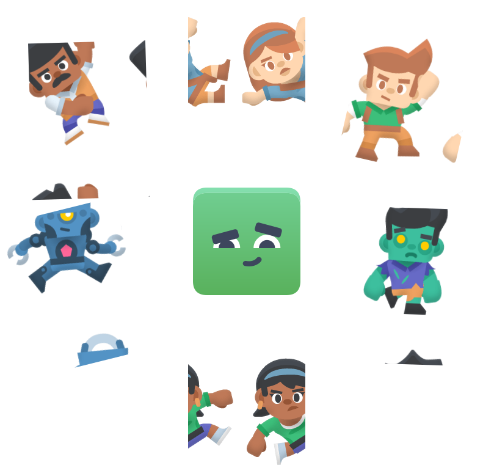

# 🌟 WordNest - Interactive Language Learning Platform

A modern, interactive language learning application inspired by Duolingo, built with cutting-edge web technologies. Learn languages through engaging quizzes, track your progress, and unlock achievements!

## 📸 Preview



## 🚀 Features

### 🎯 Core Learning Features

- **Interactive Lessons**: Engaging SELECT and ASSIST type challenges
- **Progressive Learning**: Structured units and lessons with unlock system
- **Audio Integration**: Native pronunciation with MP3 audio files
- **Visual Learning**: SVG-based character illustrations
- **Real-time Feedback**: Instant correct/incorrect responses
- **Hearts System**: Gamified learning with life points

### 🎮 Gamification

- **Points & XP System**: Earn points for correct answers
- **Leaderboard**: Compete with other learners
- **Quests & Achievements**: Complete daily/weekly challenges
- **Streak Tracking**: Maintain learning consistency
- **Progress Visualization**: Visual progress bars and completion rates

### 💎 Premium Features

- **Unlimited Hearts**: No interruptions in learning flow
- **Advanced Content**: Access to premium lessons and units
- **Priority Support**: Enhanced customer service
- **Offline Mode**: Download lessons for offline learning

### 🤖 AI Integration

- **Voice Assistant**: Powered by Vapi AI for pronunciation practice
- **Smart Recommendations**: Personalized learning paths
- **Adaptive Difficulty**: AI-adjusted challenge levels

## 🛠️ Tech Stack

### Frontend

- **Next.js 15**: React framework with App Router
- **React 19**: Component-based UI library
- **TypeScript**: Type-safe JavaScript
- **Tailwind CSS**: Utility-first CSS framework
- **Shadcn/UI**: Pre-built component library
- **Lucide Icons**: Modern icon library
- **Lottie Animations**: JSON-based animations

### Backend & Database

- **Neon PostgreSQL**: Serverless PostgreSQL database
- **Drizzle ORM**: Type-safe database toolkit
- **Server Actions**: Next.js server-side functions
- **API Routes**: RESTful API endpoints

### Authentication & Security

- **Clerk**: Complete authentication solution
- **Protected Routes**: Middleware-based route protection
- **User Management**: Profile, preferences, and progress tracking

### Payment Processing

- **Stripe**: Secure payment gateway
- **Webhooks**: Real-time payment status updates
- **Subscription Management**: Recurring billing system

### Deployment & DevOps

- **Vercel**: Serverless deployment platform
- **Git**: Version control
- **ESLint**: Code linting
- **Prettier**: Code formatting

## 📦 Project Structure

```
wordnest/
├── 📁 app/                      # Next.js App Router
│   ├── 📁 (main)/              # Main app layout
│   │   ├── 📁 courses/         # Course selection
│   │   ├── 📁 learn/           # Learning dashboard
│   │   ├── 📁 leaderboard/     # Competition rankings
│   │   ├── 📁 quests/          # Daily challenges
│   │   └── 📁 shop/            # Premium store
│   ├── 📁 (marketing)/         # Landing page
│   ├── 📁 admin/               # Content management
│   ├── 📁 api/                 # API endpoints
│   ├── 📁 lesson/              # Lesson interface
│   └── 📁 buttons/             # UI components demo
├── 📁 components/              # Reusable components
│   ├── 📁 ui/                  # Shadcn UI components
│   └── 📁 modals/              # Modal dialogs
├── 📁 db/                      # Database configuration
│   ├── schema.ts               # Drizzle schema
│   ├── queries.ts              # Database queries
│   └── drizzle.ts              # DB connection
├── 📁 scripts/                 # Database scripts
│   ├── seed.ts                 # Initial data seeding
│   └── reset.ts                # Database reset
├── 📁 public/                  # Static assets
│   ├── 📁 *.svg                # Character illustrations
│   ├── 📁 *.mp3                # Audio pronunciations
│   └── 📁 *.json               # Lottie animations
└── 📁 store/                   # State management
```

## 🌍 Language Support

### Currently Available

- **🇪🇸 Spanish**: Complete course with 2 units, 8 lessons, 24 challenges

### Planned Languages

- **🇫🇷 French**: Assets available, content in development
- **🇮🇹 Italian**: Assets available, content in development
- **🇭🇷 Croatian**: Assets available, content in development

## 📚 Content Structure

### Spanish Course (🇪🇸)

**Unit 1: Learn the Basics**

1. **People** - el hombre (man), la mujer (woman), el robot (robot)
2. **Family** - el niño (boy), la niña (girl), la mujer (woman)
3. **Characters** - el zombi (zombie), el robot (robot), el hombre (man)
4. **Mixed Practice** - Review of all characters
5. **Unit 1 Review** - Comprehensive review

**Unit 2: Expand Vocabulary** 6. **Advanced People** - Extended character practice 7. **Relationships** - Character interactions 8. **Unit 2 Review** - Complete unit review

### Challenge Types

- **SELECT**: Multiple choice with visual and audio cues
- **ASSIST**: Pronunciation practice with AI feedback

## 🔧 Setup Instructions

### Prerequisites

- **Node.js**: v18+ required
- **npm/yarn**: Package manager
- **Git**: Version control

```

```

## 🔗 External Services Setup

### Required Services

#### 1. Neon Database (Required)

- **Purpose**: PostgreSQL database hosting
- **Setup**:
  1. Sign up at [neon.tech](https://neon.tech)
  2. Create a new project
  3. Copy connection string to `DATABASE_URL`
- **Cost**: Free tier available (3GB storage)

#### 2. Clerk Authentication (Required)

- **Purpose**: User authentication and management
- **Setup**:
  1. Sign up at [clerk.dev](https://clerk.dev)
  2. Create new application
  3. Copy publishable and secret keys
- **Cost**: Free tier (10,000 monthly active users)

### Optional Services

#### 3. Stripe Payments (Optional)

- **Purpose**: Premium subscription billing
- **Setup**:
  1. Sign up at [stripe.com](https://stripe.com)
  2. Get API keys from dashboard
  3. Set up webhook endpoint for `/api/webhooks/stripe`
- **Cost**: 2.9% + 30¢ per transaction

#### 4. Vapi AI (Optional)

- **Purpose**: Voice assistant for pronunciation
- **Setup**:
  1. Sign up at [vapi.ai](https://vapi.ai)
  2. Create assistant and get public key
- **Cost**: Pay-per-use

## 📋 Available Scripts

```bash
# Development
npm run dev          # Start development server
npm run build        # Build for production
npm run start        # Start production server
npm run lint         # Run ESLint

# Database
npm run db:reset     # Clear all database tables
npm run db:seed      # Populate with sample data
npm run db:studio    # Open Drizzle Studio (database GUI)

# Testing
npm run test         # Run test suite (if configured)
```

## 🎯 Usage Guide

### For Learners

1. **Sign Up**: Create account via Clerk authentication
2. **Choose Course**: Select Spanish (more languages coming)
3. **Start Learning**: Begin with Unit 1, Lesson 1
4. **Complete Challenges**: Answer SELECT and ASSIST questions
5. **Track Progress**: Monitor points, hearts, and completion
6. **Compete**: Check leaderboard rankings
7. **Upgrade**: Purchase premium for unlimited hearts

### For Administrators

1. **Access Admin Panel**: `/admin` (requires admin privileges)
2. **Manage Courses**: Add/edit course content
3. **Create Lessons**: Design new learning modules
4. **Add Challenges**: Create SELECT/ASSIST questions
5. **Monitor Users**: Track learning analytics

## ⚠️ Current Limitations

### Content Constraints

- **Single Language**: Only Spanish course is complete
- **Limited Vocabulary**: Basic nouns and characters only
- **Unit Count**: 2 units with 8 lessons total
- **Challenge Types**: Only SELECT and ASSIST formats

### Technical Constraints

- **Audio Assets**: Limited to 6 Spanish pronunciations
- **Visual Assets**: Character-based SVGs only
- **Mobile**: Responsive but not PWA
- **Offline**: No offline learning capability

### Service Dependencies

- **Database**: Requires Neon PostgreSQL connection
- **Authentication**: Clerk service dependency
- **Payments**: Stripe for premium features
- **Voice**: Vapi AI for pronunciation (optional)

## 🔮 Future Roadmap

### Planned Features

- **Multiple Languages**: French, Italian, Croatian courses
- **Advanced Challenges**: Writing, listening, speaking tests
- **Social Features**: Friends, groups, challenges
- **Mobile App**: React Native version
- **Offline Mode**: Download for offline learning
- **AI Tutor**: Personalized learning assistance

### Content Expansion

- **Grammar Lessons**: Verb conjugations, sentence structure
- **Vocabulary Categories**: Food, travel, business, etc.
- **Cultural Content**: History, traditions, customs
- **Certification**: Official language proficiency certificates

## 🤝 Contributing

We welcome contributions! Please see our [Contributing Guide](CONTRIBUTING.md) for details.

### Development Setup

1. Fork the repository
2. Create feature branch: `git checkout -b feature/amazing-feature`
3. Commit changes: `git commit -m 'Add amazing feature'`
4. Push to branch: `git push origin feature/amazing-feature`
5. Open Pull Request

## 📄 License

This project is licensed under the MIT License - see the [LICENSE](LICENSE) file for details.

## 🙏 Acknowledgments

- **Original Inspiration**: [Duolingo](https://duolingo.com) for the learning methodology
- **UI Components**: [Shadcn/UI](https://ui.shadcn.com) for beautiful components
- **Icons**: [Lucide](https://lucide.dev) for consistent iconography

## 📞 Support

- **Documentation**: Check this README and inline comments
- **Issues**: Report bugs via GitHub Issues
- **Discussions**: Use GitHub Discussions for questions
- **Email**: Contact maintainers for urgent matters

---

**Built with ❤️ for language learners worldwide**

_Last updated: September 2025_
